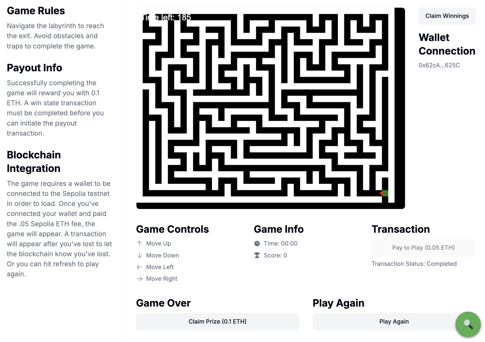

# Labrinto: A Web3 Maze Adventure



## 🎮 Play Now!
[Launch Labrinto](https://labrito-3ukdb1to3-plotjs-projects.vercel.app/)

## 🌟 Introduction

Labrinto is an exciting Web3 maze game that combines classic arcade fun with blockchain technology. Navigate through a challenging labyrinth, race against time, and win crypto rewards!

This project showcases the integration of traditional game development with Web3 capabilities, demonstrating a practical application of blockchain in gaming.

## 🚀 Features

- **Web3 Integration**: Connect your wallet and play with real crypto stakes
- **Smart Contract Powered**: Fully decentralized gameplay mechanics
- **Time-based Challenges**: Navigate the maze before time runs out
- **Crypto Rewards**: Win double your entry fee upon successful completion
- **Responsive Design**: Enjoy on both desktop and mobile devices

## 🛠 Tech Stack

- **Frontend**: Next.js, React
- **Styling**: Tailwind CSS
- **Blockchain Interaction**: ethers.js
- **Smart Contract**: Solidity
- **Network**: Sepolia Testnet

## 🔗 Smart Contract

Labrinto's game logic is powered by a smart contract deployed on the Sepolia testnet:

[View Contract on Etherscan](https://sepolia.etherscan.io/address/0xdbde4c6a6a7b7c55309242d8e3e1c86fbf0cf2e5)

## 🎮 How to Play

1. Connect your Web3 wallet (MetaMask recommended)
2. Pay the entry fee (0.05 Sepolia ETH)
3. Navigate the maze using arrow keys
4. Reach the exit before time runs out
5. Claim your prize if you win!

## 🧪 Local Development

To run Labrinto locally:

```bash
git clone https://github.com/your-username/labrinto.git
cd labrinto
npm install
npm run dev
```

Open [http://localhost:3000](http://localhost:3000) in your browser to start playing!

## 🤝 Contributing

Contributions, issues, and feature requests are welcome! Feel free to check [issues page](https://github.com/your-username/labrinto/issues).

## 📜 License

Distributed under the MIT License. See `LICENSE` for more information.

---

## 🚧 Future Updates

- **Improving Usability of Blockchain Interaction Buttons**: Enhance the user interface and experience for interacting with blockchain functions to make it more intuitive.
- **Transaction Completion Notices**: Implement notifications to inform users when transactions are pending and when they have successfully completed.
- **Deposit Credits Function**: Introduce a feature that allows players to deposit credits, enabling them to play multiple times without needing to re-enter funds each time.
- **Custom Wagering Amounts**: Allow players to wager custom amounts instead of a fixed entry fee, providing more flexibility in gameplay.
- **NFT Minting**: Give players an NFT for winning.

⭐️ If you like Labrinto, give it a star!

